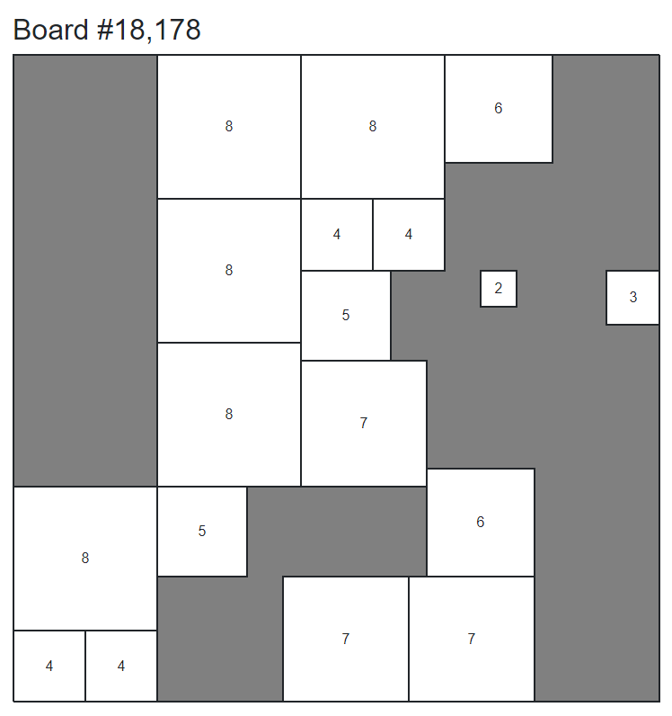

# squareful.io

This is a deduction puzzle for the web, based on [Partridge squares](https://pyrigan.com/2017/02/17/the-partridge-puzzle/).  There are many possible puzzle modes, but I'll likely generate a daily puzzle with the board partially shrouded according to the difficulty for that day.  The goal for the player is to deduce the location of the solitary size-1 square in the 36x36 overall square, in a single guess. In the process the player gets to reason deductively in a setting of small number arithmetic and simple spatial geometry

This idea started out in [another repo](https://github.com/jasonincanada/square-game) in Haskell, but I'm doing this now as a [Blazor WebAssembly](https://dotnet.microsoft.com/en-us/apps/aspnet/web-apps/blazor) app so I can do the whole thing in C#, even the client side (which would normally be in JavaScript).  Also, this is more of a puzzle than a game so I took the opportunity to change the project name, and managed to grab the `squareful.io` domain name, which was still available

## Example

Below is a sample shrouding of board #18,178.  It is possible to deduce the exact location of the 1x1 square in one move:

## Roadmap

The rough roadmap:

- [x] Buy `squareful.io`
- [x] Ingest static data into some store
  - [x] Local file
  - [ ] Database (CosmosDB ?)
- [x] Board explorer
  - [x] Render board 1 <= n <= 18656
- [ ] Generate shrouds
- [ ] Daily puzzle
- [ ] Deployment
